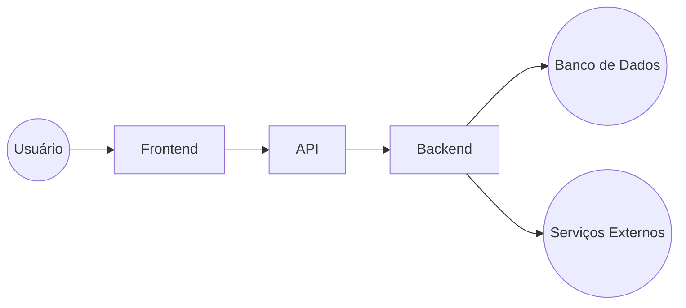

# Modelagem da Arquitetura da Solução

## Componentes da Solução Técnica

### Frontend
- **Descrição**: Aplicação web responsiva desenvolvida com [tecnologia utilizada, ex.: React, Vue.js, Next.js].
- **Função**: Interface com o usuário para coleta de dados, exibição de informações e interação com o backend.
- **Comunicação**: Requisições HTTP (REST) ou WebSocket para comunicação em tempo real com o backend.

### Backend
- **Descrição**: Servidor de aplicação desenvolvido com [tecnologia utilizada, ex.: Node.js/Express, Django, Flask, Spring Boot].
- **Função**: Processamento das requisições do frontend, execução de regras de negócio e acesso ao banco de dados.
- **Comunicação**: Fornecimento de APIs RESTful (ou GraphQL) para o frontend e conexão segura com o banco de dados.

### APIs
- **Descrição**: Interfaces para comunicação entre frontend e backend.
- **Função**: Disponibilizar endpoints para operações de CRUD, autenticação e integração com serviços externos.
- **Formato de Dados**: JSON.

### Banco de Dados
- **Descrição**: Sistema de gerenciamento de banco de dados relacional (PostgreSQL, MySQL) ou não relacional (MongoDB, Firebase).
- **Função**: Armazenamento persistente de informações da aplicação.

### Serviços Externos (opcional)
- **Descrição**: APIs de terceiros como serviços de autenticação, pagamento, envio de e-mails, mapas, armazenamento de arquivos.
- **Exemplos**: Auth0, Firebase Auth, Stripe, AWS S3.

## Fluxo de Dados

1. O **usuário** interage com o **frontend**.
2. O **frontend** envia uma **requisição HTTP** para o **backend** via **API**.
3. O **backend** processa a requisição:
    - Executa regras de negócio.
    - Acessa o **banco de dados** para ler ou gravar dados.
4. O **backend** retorna uma **resposta** ao **frontend**.
5. O **frontend** atualiza a interface para o **usuário**.
6. Quando necessário, o **backend** também se comunica com **serviços externos**.

## Diagrama de Comunicação

